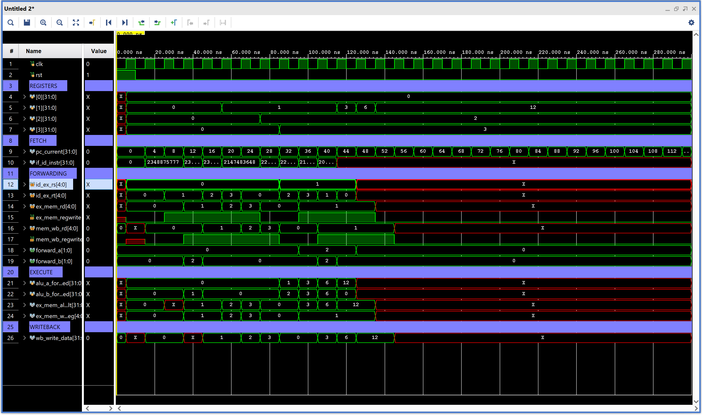

# EX/MEM Data Forwarding Optimization — MIPS Pipeline

## What Changed

We modified our working 5-stage MIPS pipeline to add **data forwarding** (bypassing), eliminating the NOP instructions previously required between dependent instructions. Three files were modified and one new module was added:

| File | Change |
|------|--------|
| `forwarding_unit.v` | **NEW** — Detects data hazards by comparing source registers (rs, rt) against destination registers of in-flight instructions |
| `execute.v` | Added two 3-to-1 **forwarding muxes** before ALU inputs A and B |
| `idExLatch.v` | Added `rs` (instr[25:21]) passthrough for the forwarding unit |
| `decode.v` | Passes `rs` field through the ID/EX latch |
| `mips_pipeline.v` | Instantiates forwarding unit, wires forwarded data paths |

## What It Does

The forwarding unit sits between the EX and MEM stages. Every cycle, it compares:
- **Current instruction's source registers** (`id_ex_rs`, `id_ex_rt`) against
- **Previous instruction's destination** (`ex_mem_rd`) and **two-back instruction's destination** (`mem_wb_rd`)

When a match is found (and the prior instruction writes a register), the forwarding unit sets `forward_a` or `forward_b` to route the computed result **directly to the ALU input**, bypassing the register file entirely.

```
Forward select encoding:
  00 = No forwarding (use register file value)
  10 = Forward from EX/MEM latch (result from 1 cycle ago)
  01 = Forward from MEM/WB latch (result from 2 cycles ago)
```

## Why It Works

In a pipeline, a register written in the Writeback stage (cycle 5) isn't available in the register file until 2 cycles after the instruction that computed it. Without forwarding, NOPs are inserted to wait. With forwarding, the result is available **immediately** from the pipeline latch — no waiting needed.

## Results

| Metric | Without Forwarding | With Forwarding |
|--------|-------------------|-----------------|
| Total instructions | 24 | 9 |
| Wasted NOP cycles | 12 | 2 |
| PC range | 0–96 | 0–36 |
| Final `$1` | **12** ✓ | **12** ✓ |

Same correct result, **2.6× fewer instructions**.

## Instruction Programs

**Original** (`instr.mem`) — 24 instructions with 12 NOPs:
```
LW $1,1($0) → LW $2,2($0) → LW $3,3($0) → NOP×2 → ADD $1,$1,$2 → NOP×3 → ADD $1,$1,$3 → NOP×3 → ADD $1,$1,$1 → NOP×4 → ADD $1,$1,$0 → NOP×5
```

**Optimized** (`instr_forwarding.mem`) — 9 instructions, 2 NOPs:
```
LW $1,1($0) → LW $2,2($0) → LW $3,3($0) → NOP×2 → ADD $1,$1,$2 → ADD $1,$1,$3 → ADD $1,$1,$1 → ADD $1,$1,$0
```

The 2 remaining NOPs are required for the **load-use hazard** (LW result isn't available until the MEM stage, which forwarding alone cannot resolve without a stall unit).

---

## Timing Diagram Analysis



### Signal Index Reference

| Row | Signal | Description |
|-----|--------|-------------|
| 1 | `clk` | System clock |
| 2 | `rst` | Reset signal |
| 3 | — | **REGISTERS** divider |
| 4 | `[0][31:0]` | Register $0 (hardwired zero) |
| 5 | `[1][31:0]` | Register $1 — **target register**, reaches 12 |
| 6 | `[2][31:0]` | Register $2 |
| 7 | `[3][31:0]` | Register $3 |
| 8 | — | **FETCH** divider |
| 9 | `pc_current` | Program Counter |
| 10 | `if_id_instr` | Fetched instruction word |
| 11 | — | **FORWARDING** divider |
| 12 | `id_ex_rs` | Source register 1 (rs) of current EX-stage instruction |
| 13 | `id_ex_rt` | Source register 2 (rt) of current EX-stage instruction |
| 14 | `ex_mem_rd` | Destination register from previous instruction (in MEM stage) |
| 15 | `ex_mem_regwrite` | Whether the MEM-stage instruction writes to a register |
| 16 | `mem_wb_rd` | Destination register from two-back instruction (in WB stage) |
| 17 | `mem_wb_regwrite` | Whether the WB-stage instruction writes to a register |
| 18 | `forward_a` | **Forwarding mux select for ALU input A** (0=none, 2=EX/MEM) |
| 19 | `forward_b` | **Forwarding mux select for ALU input B** (0=none, 2=EX/MEM) |
| 20 | — | **EXECUTE** divider |
| 21 | `alu_a_forwarded` | Actual value fed to ALU input A (after forwarding mux) |
| 22 | `alu_b_forwarded` | Actual value fed to ALU input B (after forwarding mux) |
| 23 | `ex_mem_alu_result` | ALU result stored in EX/MEM pipeline latch |
| 24 | `ex_mem_write_reg` | Destination register stored in EX/MEM latch |
| 25 | — | **WRITEBACK** divider |
| 26 | `wb_write_data` | Final value written back to the register file |

### Cycle-by-Cycle Forwarding Trace

#### ADD $1,$1,$2 executes (~80ns) — No forwarding needed

The LW instructions have already completed writeback, so the register file contains the correct values.

- **Row 12** (`id_ex_rs`) = 1 → instruction reads `$1`
- **Row 13** (`id_ex_rt`) = 2 → instruction reads `$2`
- **Row 15** (`ex_mem_regwrite`) = 0 → previous instruction (NOP) doesn't write
- **Row 18** (`forward_a`) = **0** → no hazard, use register file
- **Row 19** (`forward_b`) = **0** → no hazard, use register file
- **Row 21** (`alu_a_forwarded`) = 1 → from register file ($1=1)
- **Row 22** (`alu_b_forwarded`) = 2 → from register file ($2=2)
- **Row 23** (`ex_mem_alu_result`) = **3** → ALU computes 1+2=3, stored in EX/MEM

#### ADD $1,$1,$3 executes (~90ns) — ⚡ FORWARDING ACTIVATES

The previous ADD just wrote to `$1`, but it hasn't reached the register file yet. The forwarding unit detects this and bypasses.

- **Row 12** (`id_ex_rs`) = 1 → wants `$1`
- **Row 14** (`ex_mem_rd`) = 1 → previous ADD's destination is also `$1`
- **Row 15** (`ex_mem_regwrite`) = 1 → previous ADD writes a register
- 🔥 **HAZARD DETECTED:** `ex_mem_rd(1) == id_ex_rs(1)` AND `regwrite=1`
- **Row 18** (`forward_a`) = **2** (binary `10`) → **forward from EX/MEM!**
- **Row 21** (`alu_a_forwarded`) = **3** → grabbed directly from EX/MEM latch, NOT register file
- **Row 22** (`alu_b_forwarded`) = 3 → from register file ($3=3)
- **Row 23** = **6** → ALU computes 3+3=6

> Without forwarding, Row 21 would show **1** (stale value). The forwarding unit injected **3** instead.

#### ADD $1,$1,$1 executes (~100ns) — ⚡ DOUBLE FORWARD

Both ALU inputs read `$1`, and the previous instruction just wrote `$1`. Both inputs are forwarded.

- **Row 12** (`id_ex_rs`) = 1, **Row 13** (`id_ex_rt`) = 1 → both read `$1`
- **Row 14** (`ex_mem_rd`) = 1, **Row 15** (`ex_mem_regwrite`) = 1
- 🔥 **DOUBLE HAZARD:** rs AND rt both match ex_mem_rd
- **Row 18** (`forward_a`) = **2** → forward from EX/MEM
- **Row 19** (`forward_b`) = **2** → forward from EX/MEM
- **Row 21** (`alu_a_forwarded`) = **6** → forwarded
- **Row 22** (`alu_b_forwarded`) = **6** → forwarded
- **Row 23** = **12** → ALU computes 6+6=12 ✅

#### ADD $1,$1,$0 executes (~110ns) — ⚡ SINGLE FORWARD

- **Row 18** (`forward_a`) = **2** → forwards 12 from EX/MEM for `$1`
- **Row 19** (`forward_b`) = **0** → no forward needed (`$0` is always 0)
- **Row 23** = **12** → 12+0=12, final result confirmed ✅

### Forwarding Summary Table

| Instruction | Row 18 (fwd_a) | Row 19 (fwd_b) | Row 21 (ALU A) | Row 22 (ALU B) | Result |
|-------------|:-:|:-:|:-:|:-:|:-:|
| ADD $1,$1,$2 | 0 (none) | 0 (none) | 1 (regfile) | 2 (regfile) | 3 |
| ADD $1,$1,$3 | **2 (EX/MEM)** | 0 (none) | **3 (fwd)** | 3 (regfile) | 6 |
| ADD $1,$1,$1 | **2 (EX/MEM)** | **2 (EX/MEM)** | **6 (fwd)** | **6 (fwd)** | 12 |
| ADD $1,$1,$0 | **2 (EX/MEM)** | 0 (none) | **12 (fwd)** | 0 (regfile) | 12 |

Row 5 (`registers[1]`) confirms the final value: **0 → 1 → 3 → 6 → 12** ✓

## Vivado Simulation Instructions

1. Add all `.v` files as design sources, `mips_pipeline_tb.v` as simulation source
2. Copy `instr_forwarding.mem` and `data.mem` to the xsim working directory
3. After launching simulation, run these Tcl commands to view forwarding signals:

```tcl
add_wave_divider "REGISTERS"
add_wave /mips_pipeline_tb/uut/stage2_decode/rf0/registers[0]
add_wave /mips_pipeline_tb/uut/stage2_decode/rf0/registers[1]
add_wave /mips_pipeline_tb/uut/stage2_decode/rf0/registers[2]
add_wave /mips_pipeline_tb/uut/stage2_decode/rf0/registers[3]
add_wave_divider "FETCH"
add_wave /mips_pipeline_tb/uut/stage1_fetch/pc_current
add_wave /mips_pipeline_tb/uut/if_id_instr
add_wave_divider "FORWARDING"
add_wave /mips_pipeline_tb/uut/fwd_unit/id_ex_rs
add_wave /mips_pipeline_tb/uut/fwd_unit/id_ex_rt
add_wave /mips_pipeline_tb/uut/fwd_unit/ex_mem_rd
add_wave /mips_pipeline_tb/uut/fwd_unit/ex_mem_regwrite
add_wave /mips_pipeline_tb/uut/fwd_unit/mem_wb_rd
add_wave /mips_pipeline_tb/uut/fwd_unit/mem_wb_regwrite
add_wave /mips_pipeline_tb/uut/fwd_unit/forward_a
add_wave /mips_pipeline_tb/uut/fwd_unit/forward_b
add_wave_divider "EXECUTE"
add_wave /mips_pipeline_tb/uut/stage3_execute/alu_a_forwarded
add_wave /mips_pipeline_tb/uut/stage3_execute/alu_b_forwarded
add_wave /mips_pipeline_tb/uut/ex_mem_alu_result
add_wave /mips_pipeline_tb/uut/ex_mem_write_reg
add_wave_divider "WRITEBACK"
add_wave /mips_pipeline_tb/uut/wb_write_data
restart
run 300ns
```

4. Right-click signals → **Radix → Unsigned Decimal** for readable values
